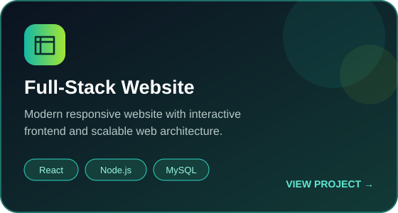
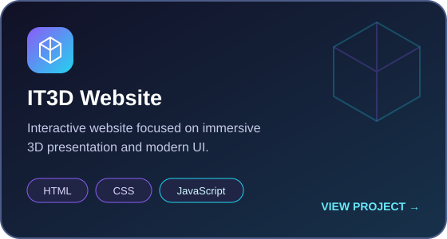
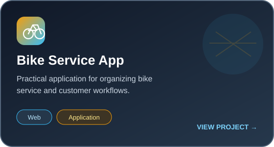
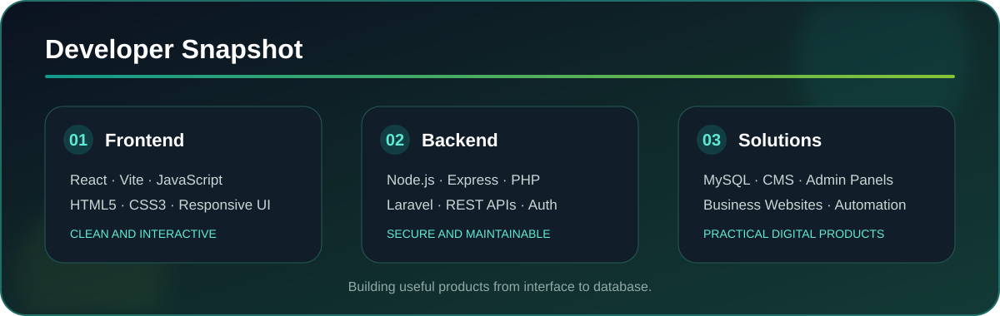

 

## 👨‍💻 About Me

I am a **Freelance Full-Stack Developer** focused on building useful, maintainable, and visually clean web products. I enjoy turning ideas and client requirements into websites, CMS platforms, admin dashboards, APIs, and workflow-driven applications.

- 🔭 Building client-ready websites, e-commerce admin panels, and custom CMS solutions
- ⚙️ Developing backends with **Node.js, Express, PHP, and Laravel**
- 🎨 Creating responsive frontends with **React, Vite, JavaScript, HTML, and CSS**
- 🗄️ Designing and working with **MySQL** databases and REST APIs
- 🌱 Exploring AWS, application scalability, digital marketing, and modern 3D web experiences
- 🤝 Available for freelance projects and developer collaborations

<h2 align="center">🛠️ Tech Stack</h2>

<h3>Frontend</h3>

  

<h3>Backend &amp; Database</h3>

  

<h3>Tools &amp; Platforms</h3>

  

## 🚀 What I Build

- Freelance websites and custom web applications
- CMS and admin dashboard applications
- REST API integrations and authentication systems
- PHP and Laravel web applications
- React and Node.js full-stack applications
- Responsive interfaces and interactive 3D web experiences

## 📌 Featured Projects

 

## ⚡ Developer Snapshot

 

## 🤝 Let's Connect

- 💼 Available for freelance website and web application projects
- 💬 Ask me about **React, Node.js, PHP, Laravel, MySQL, CMS platforms, REST APIs, and modern web development**

### Clean code. Useful products. Better digital experiences.

